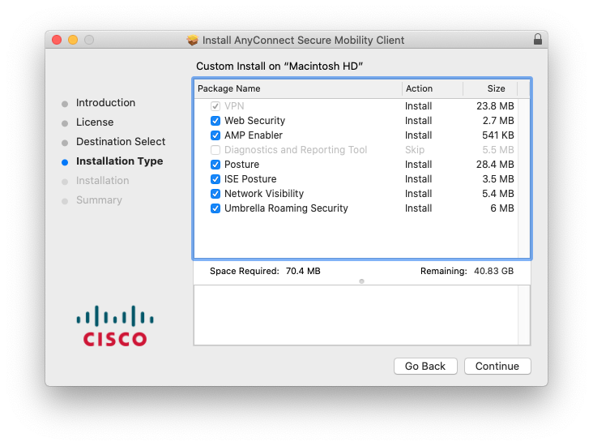
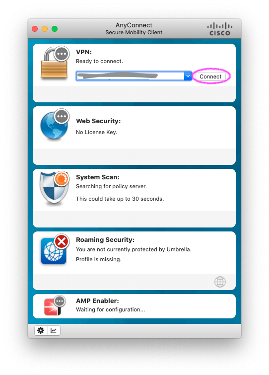
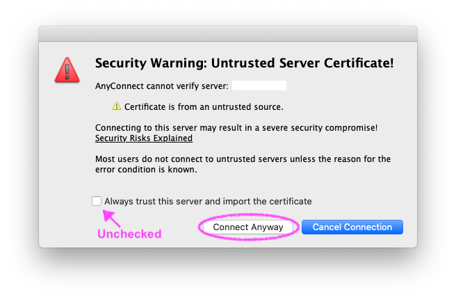
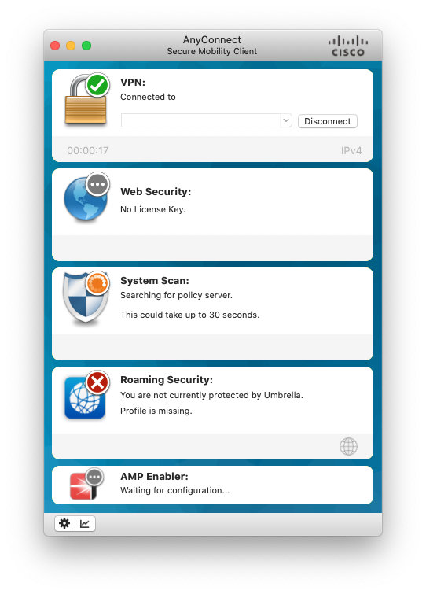
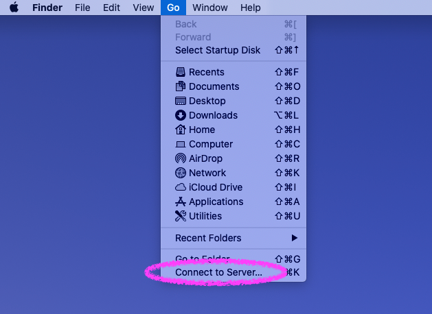
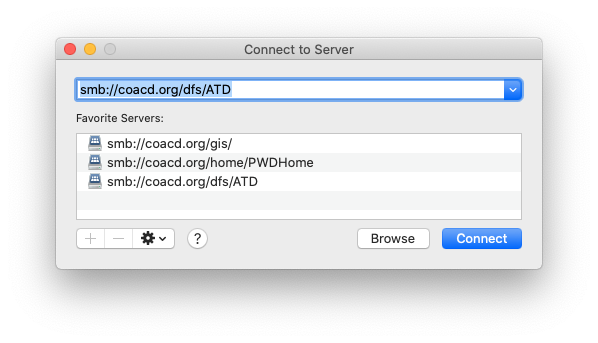

# Working Remotely from a Mac

## Antivirus Software

Per the [City of Austin Anti-Virus Policy](https://cityofaustin.sharepoint.com/sites/COATeleworkInstructions/Shared%20Documents/Forms/AllItems.aspx?id=%2Fsites%2FCOATeleworkInstructions%2FShared%20Documents%2FCOA%20Anti%20Virus%20Policy%2Epdf\&parent=%2Fsites%2FCOATeleworkInstructions%2FShared%20Documents\&p=true\&originalPath=aHR0cHM6Ly9jaXR5b2ZhdXN0aW4uc2hhcmVwb2ludC5jb20vOmI6L3MvQ09BVGVsZXdvcmtJbnN0cnVjdGlvbnMvRWMxelktZ2JZcDFFbWFVQzNXeWhSQWdCOWwzZ2R4M2ZGaHhFTVhlajlJWG1oUT9ydGltZT1McElKQXFUUjEwZw), all City-owned computers must have up-to-date virus protection installed and active.&#x20;

The TrendMicro website has Mac installers and installation instructions [here](https://esupport.trendmicro.com/en-us/home/pages/technical-support/antivirus-for-mac/1060983.aspx). You will need the serial number in CTM's [_Anti-Virus for Non-COA Computers_](https://cityofaustin.sharepoint.com/sites/COATeleworkInstructions/Shared%20Documents/Anti-Virus%20for%20Non%20COA%20Computers.pdf) doc.

## Network Access with AnyConnect

You need to be on the City of Austin's internal network to access resources such as shared network drives, the HR Portal, and enterprise web applications like eCombs and eCapris. You can use Cisco AnyConnect to connect to the City's Virtual Private Network (VPN) when working remotely. &#x20;

### Installing AnyConnect

1\. Download the installer [here](https://drive.google.com/drive/u/0/folders/114rRG9OvTCWTXYqVg-AHaZgnrv\_PCvEE).

2\. Double-click the downloaded file to open the disk image, then double-click on **AnyConnect.pkg**.&#x20;

3\. When the installer opens, click "Continue," "Agree," and leave the defaults on for the installation type:&#x20;

<figure><figcaption></figcaption></figure>

4\. When prompted, provide the password you use to log in to your computer, and the installation will begin. It will take a few minutes to run. &#x20;

5\. Once told the installation has been completed successfully, click "Move to Trash" to delete the installer.&#x20;

6\. You should now see a **Cisco** folder in your **Applications** folder. Double-click on the **Cisco AnyConnect Secure Mobility Client** to open the application.&#x20;


If you are running OSX Catalina, you may need to [take another step](broken-reference) to complete the configuration.&#x20;


### Using AnyConnect

1\. Open the application. In the empty field below "Ready to Connect," enter the IP address of the City's VPN server.&#x20;


The IP address is sensitive information. Get it directly from your supervisor or another Mac user. &#x20;


2\. Click the "Connect" button.&#x20;

2\. A warning will appear. Do _**not**_ check the "Always trust..." option and click "Connect Anyway."&#x20;

3\. A window asking for your username and password will appear. Use your City of Austin email address and Network password to log in.&#x20;

.png>)

4\. The same window may reappear, just for fun. 🙃 Again, click "Connect Anyway" and leave the "Always trust..." option unchecked.&#x20;

At this point, there may be a bit of a hang while the connection is made. Once the green checkbox appears, you are connected and ready to access network resources.&#x20;


Streaming video or audio while connected to the City network will negatively impact the speed with which other employees can access shared drives, SharePoint, and the City’s intranet.&#x20;


### Uninstalling AnyConnect

When troubleshooting your VPN connection, you may want to wipe all installs of AnyConnect and start fresh. You can use **Uninstall AnyConnect**, located in the **Cisco** folder in **Applications**.

## Shared Drive Access

You must access the G Drive from the City of Austin Network. If you don't have a wired connection, [use AnyConnect](./#using-anyconnect). &#x20;

1\. From the Finder menu, select **Go** > **Connect to Server.**&#x20;

2\. Enter `smb://coacd.org/dfs/ATD` in the **Server Address** field and click "Connect."&#x20;

3\. You will be prompted for your City of Austin Network Username and Password. Once submitted, a Finder window will open to the G Drive.&#x20;

