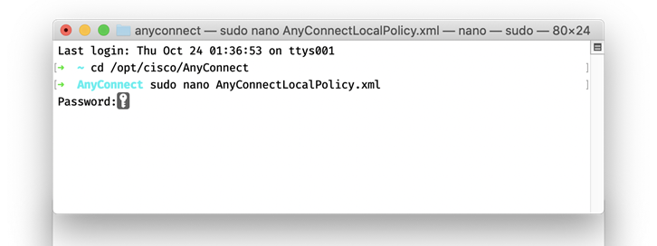
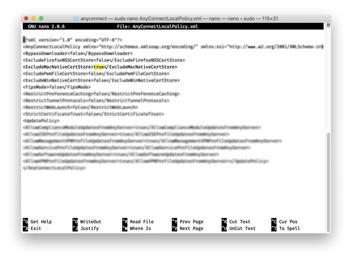

# Troubleshooting AnyConnect for macOS Catalina

1\. In Finder, open **Applications/Utilities** and open Terminal.&#x20;

Type `cd /opt/cisco/AnyConnect` and press **Enter**.&#x20;

2\. Type `cd /opt/cisco/AnyConnect` and press **Enter**.&#x20;

3\. Type `sudo nano AnyConnectLocalPolicy.xml` and press **Enter**.&#x20;

4\. Type your admin password (the one you use to log on to your computer) and press **Enter.**

<figure><figcaption></figcaption></figure>

5\. Change the highlighted text from `false` to `true`.

<figure><figcaption></figcaption></figure>

6\. Press **ctrl+x** to exit.\
7\. Press **Y** to save changes when prompted.
