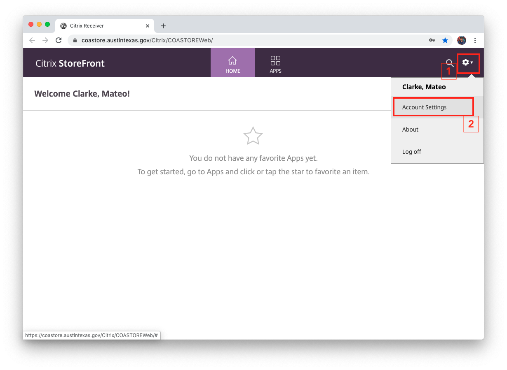
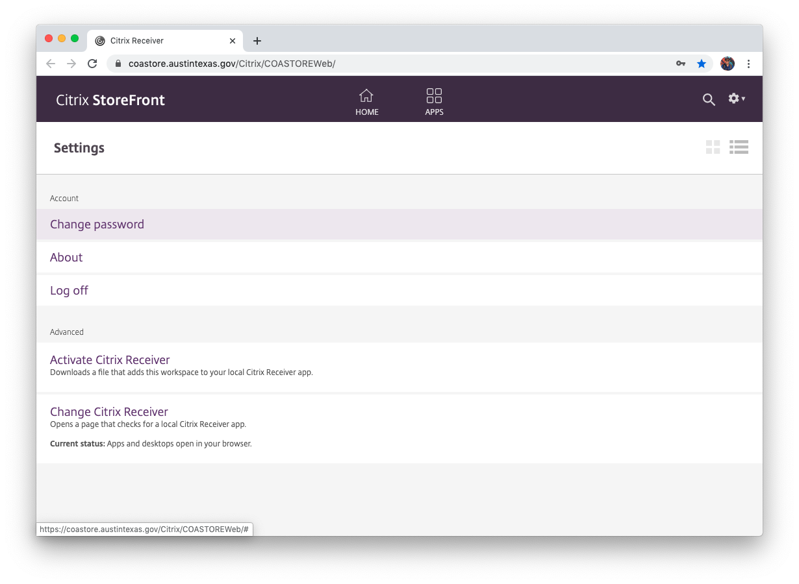

# Resetting Your Network Password from a Mac

1. **Get set up with a PC assigned to your Citrix profile.** You may have to contact Scott Reedy for assistance with this step, but you'll need a PC assigned to your Citrix profile.&#x20;
2. Connect to the VPN [via Cisco AnyConnect](./#using-anyconnect).
3. Log in to [Citrix Store Front](https://coastore.austintexas.gov/Citrix/COASTOREWeb/) using your CoA username and password.\
   **URL:** [https://coastore.austintexas.gov/Citrix/COASTOREWeb/](https://coastore.austintexas.gov/Citrix/COASTOREWeb/)\
   **Username:** `coacd\` + your last name and first initial. Ex: coacd\clarkem\
   **Password:** your CoA Network password (same as Outlook)
4. Click the Settings ⚙️ icon in the top right, then "Account Settings."

<figure><figcaption></figcaption></figure>

5. Click "Change password."

<figure><figcaption></figcaption></figure>

6. Fill out the Change Password form and click "OK."
7. Once you change your password in Citrix, **immediately log out of AnyConnect.** It is possible to lock yourself out because you are logged into AnyConnect with the old password at that time. You can reach out to Scott Reedy to unlock you if that happens.
