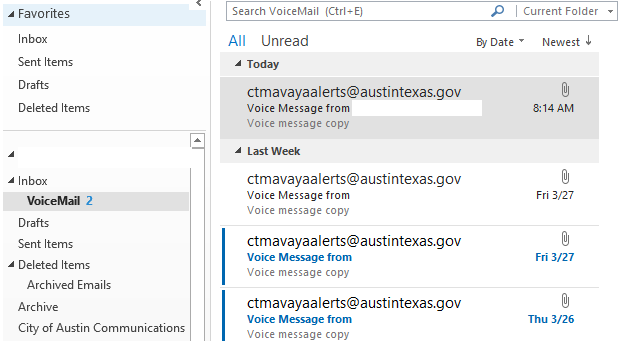

# Voicemail to Email \(Avaya Unified Messaging\)

## CTM Help guide

Download here or see instructions below



## Avaya Unified Messaging - How to access voicemail via e-mail

Unified messaging \(or UM\) is a business term for the integration of different electronic messaging and communications media \(e-mail, SMS, fax, voicemail, video messaging, etc.\) technologies into a single interface, accessible from a variety of different devices. This Avaya UM User Guide will focus only on the voicemail feature and how to access that voicemail via e-mail. 

#### Notes

* The Avaya UM software creates an audio file and attaches it to an e-mail. 
* The e-mail will come from **ctmavayaalerts@austintexas.gov.** 
* The message light on the desk phone **will not** indicate a voicemail has been received. 
* The Avaya voicemail system server **automatically deletes** original audio recordings after **fourteen \(14\) days**. 
* The **e-mail owner is responsible** for identifying potential records that may need records retention management – same as any other e-mail that is received and identified as a record. 
* The e-mail owner should manage their voicemails according to their department Records Retention Management Policy _\(seek guidance from management\)_ if applicable.

### Accessing Voicemail via E-mail

The voicemail is sent to the user’s Inbox via Outlook like any other e-mail.

Double-click the e-mail to view the attached audio file.

Double-click the attached audio recording file to open the audio dialog box. 

Once the audio file is open, the voicemail will begin playing automatically _\(make sure speakers are not muted to hear message\)._

Once the voicemail is finished, click the “X” to close.

### Managing Voicemail via E-mail Message Rules \(Optional\)

Go to Outlook, select and right-click on Inbox, and then click on “New Folder.”

Name the new folder \(e.g. Voicemail\), and then hit enter.

Go back to your Inbox and select the **ctmavayaalerts@austintexas.gov** e-mail.

There are two paths for creating a new rule: 

* Right-click on the e-mail, select Rules, and then create.

Click the Rules icon from the Home ribbon.

Both options will open a Create Rule dialog box.

Under “When I get e-mail with all of the selected conditions,” select the “From CTM Avaya Alerts” box_._

Under “Do the following,” select “Move the item to folder.”

If the folder name box does not show the name of the newly created folder, click on the Select Folder button and click the name of the new folder, and then OK.

In the Success dialog box, select the “Run this rule now on messages already in the current folder” box, and then click OK.

All received and incoming e-mails from ctmavayaalerts@austintexas.gov will now go directly into the new folder.

#### NOTE

The e-mail owner is responsible for identifying potential records that may need records retention management – same as any other e-mail that is received and is identified as a record. 

The e-mail owner should manage their voicemails according to their department Records Retention Management Policy \(seek guidance from management\) if applicable.

