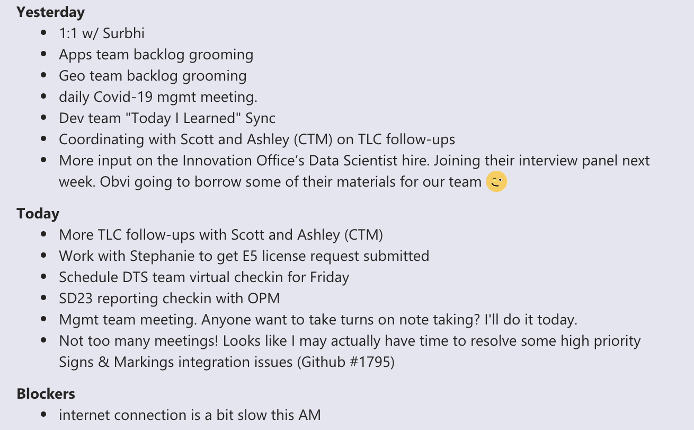

# Slack

We use Slack to stay in touch with our teammates. Your supervisor will provide you with an invitation to the [City of Austin Slack](https://austininnovation.slack.com/signup). 

Please join Austin Transportation channels,  prepended with `atd.` These include:

* **atd**
* **atd-data-tech** - open to all City employees, default for team discussions 
* **atd-data-tech-real-talk** - private channel for sensitive information/conversations or those completely irrelevant to anyone else, e.g. "Turn in your timesheets"
* **atd-dev​**
* **atd-product​**
* **atd-standup** - everyone on the DTS team posts a daily standup here

## Daily Stand Up

We keep each other up to date on our progress and blockers by posting in [\#atd-standup](https://app.slack.com/client/T04KZA1MB/CHXHA8YAU) every day:

* What did you do yesterday?
* What are you doing today?
* Any blockers?

It's helpful to cite specific Github issues you're working on. 

