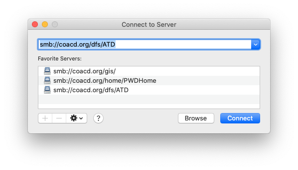

# Working Remotely from a Mac

## Antivirus Software

Per the [City of Austin Anti-Virus Policy](https://cityofaustin.sharepoint.com/sites/COATeleworkInstructions/Shared%20Documents/Forms/AllItems.aspx?id=%2Fsites%2FCOATeleworkInstructions%2FShared%20Documents%2FCOA%20Anti%20Virus%20Policy%2Epdf&parent=%2Fsites%2FCOATeleworkInstructions%2FShared%20Documents&p=true&originalPath=aHR0cHM6Ly9jaXR5b2ZhdXN0aW4uc2hhcmVwb2ludC5jb20vOmI6L3MvQ09BVGVsZXdvcmtJbnN0cnVjdGlvbnMvRWMxelktZ2JZcDFFbWFVQzNXeWhSQWdCOWwzZ2R4M2ZGaHhFTVhlajlJWG1oUT9ydGltZT1McElKQXFUUjEwZw), all City-owned computers must have up to date virus protection installed and active. 

The TrendMicro website has Mac installers and installation instructions [here](https://esupport.trendmicro.com/en-us/home/pages/technical-support/antivirus-for-mac/1060983.aspx). You will need the serial number provided in CTM's [_Anti-Virus for Non COA Computers_](https://cityofaustin.sharepoint.com/sites/COATeleworkInstructions/Shared%20Documents/Anti-Virus%20for%20Non%20COA%20Computers.pdf) doc.

## Network Access

You need to be on the City of Austin internal network to access various resources such as shared network drives, the HR Portal, the original CitySpace, and many City of Austin Sharepoint sites. When working remotely without an ethernet connection, you can use the Cisco AnyConnect to connect to the City's Virtual Private Network \(VPN\).  

### Installing AnyConnect

1. Download the installer [here](https://cityofaustin.sharepoint.com/sites/ATD/DTS/_layouts/15/touchapp.aspx?Mode=DocLibs&Page=%7B6DDEFCF0-1E6F-4761-AAE4-5101ADEEFC22%7D&Path=Tools%20%26%20Communication%2FCisco%20AnyConnect).

2. Double-click the downloaded file to open the disk image, then double-click on **AnyConnect.pkg**. 

3. When the installer opens, click "Continue", "Agree", and leave the defaults on for the installation type: 

4. When prompted, provide the password you use to log in to your computer and the installation will begin. It will take a few minutes to run.  

5. Once it says the installation has been completed successfully, you can click "Move to Trash" to delete the installer. 

6. You should now see a **Cisco** folder in your **Applications** folder. Double-click on the **Cisco AnyConnect Secure Mobility Client** to open the application. 


If you are running OSX Catalina, you may need to [take an additional step](catalina-workaround.md) to complete configuration. 


### Using AnyConnect

1. Open the application. In the empty field below "Ready to Connect", enter the IP address of the City's VPN server. 


The IP address is sensitive information. If you don't already have access to it, submit a [DTS Service Request](https://atd.knack.com/dts#new-service-request) and we'll get it to you securely. 


2. Click "Connect" button. 

2. A warning will appear. Do _**not**_ check the "Always trust..." option and click "Connect Anyway." 

3. A window asking for your username and password will appear. Use your City of Austin email address and [Network Password](../../computer-management/managing-your-network-password.md) to log in. 

4. The same window may reappear, just for fun. 🙃 Again, click "Connect Anyway" and leave the "Always trust..." option unchecked. 

At this point, there may be a bit of a hang while the connection is made. Once the green checkbox appears, you are connected and ready to access network resources. 


Streaming video or audio while connected to the City network will negatively impact the speed with which other employees can access shared drives, SharePoint, and the City’s intranet. 

If you need to participate in a remote meeting or stream video while connected to the network via VPN, please use your phone or another device. 


### Uninstalling AnyConnect

If you find yourself troubleshooting a failed install, make sure you have uninstalled any previous installs. 

From the Finder, go to the **Applications** folder.

1. Look for the **Cisco** folder and open it
2. Double click **Uninstall AnyConnect** to start the uninstall process
3. Follow instructions to uninstall VPN program

## Shared Drive Access

You must be on the City of Austin Network to access the G Drive. If you don't have a wired connection, follow the procedure above to VPN in.  

1. From the Finder menu, select **Go** &gt; **Connect to Server.** 

2. Enter `smb://coacd.org/dfs/ATD` in the **Server Address** field and click "Connect." 

3. You will be prompted for your City of Austin Network Username and Password. Once submitted, a Finder window will open to the G Drive. 

Additionally, if you need to remote into your work computer follow the instructions for [Connecting from Inside the COA Network](https://atd-dts.gitbook.io/atd-staff-resources/working-remotely/citrix-receiver/inside-coa-network)

